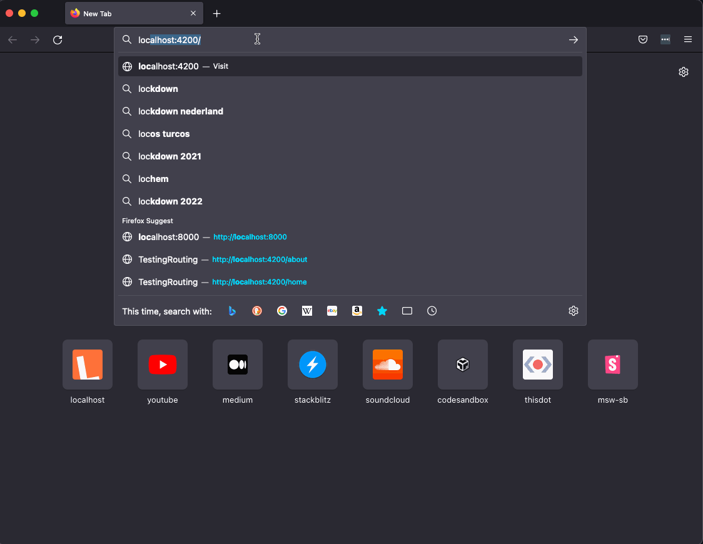

# SWAPI Playground
Try a live version [here](https://dc96s2y1hkfuo.cloudfront.net/).

This React app demonstrates some basic functionalities like routing and fetching, using the Star Wars API. 



## Setup
To run this project locally, you need [`npm`](https://docs.npmjs.com/downloading-and-installing-node-js-and-npm). 

To run the project, use the following commands:
```sh
git clone git@gitlab.com:m-rc/swapi-playground.git
cd ./swapi-playground
npm i
npm run start
```

Now wait for the development server to start and navigate to [http://localhost:3000](http://localhost:3000). Happy browsing!

## Project
This project was bootstrapped with `create-react-app`. Setup:
```sh
npx create-react-app swapi-playground --template typescript
npm i react-router-dom
# styling and fonts
npm install @mui/material @emotion/react @emotion/styled @mui/icons-material @fontsource/roboto
```


## Styling
Colors are picked from the Material UI Palette, [see here](https://mui.com/customization/color/#color-palette)

## Improvements
Plenty of room for improvements - what stands out most right now is the duplication of code based on the API calls (loading state, error state, error handling).

### Performance Optimisation
1. Request caching and prefetching! For example using [react-query] (https://react-query.tanstack.com/) or custom logic. Especially popular pages can be pre-fetched when the user first enters the page. Also the React Suspense API (will be out of beta in V18...)

### UX Improvements
1. User: The option to 'star ⭐️' your favorite star wars characters and to share that list with your friends.
2. Lightsaber sound effects.


### Code quality
1. Static code quality check: ESLint, Prettier. (e.g. through a git hook with Husky, or in CI/CD..)
2. Unit testing (e.g. with Jest) would be a relatively quick improvement to increase confidence in the code.
3. E2E testing for different complete user flows.
4. CI/CD including linting and test steps
5. Error handling: Setting [error boundaries](https://reactjs.org/docs/error-boundaries.html), improving error handling for data calls.
6. Bug fix: 'memory leak' when clicking away from page before promise resolves. Using the clean-up function of useEffect would do, with a simple implementation of [AbortController](https://developer.mozilla.org/en-US/docs/Web/API/AbortController/abort). That aborts the fetch request when clciking away to a different page.

## Resources
In general, favorite react resources:
Favorite react resources for this little app
- React docs
- React blog of [Robin Wieruch](https://www.robinwieruch.de/)
- React blog of [Max Rozen](https://maxrozen.com/race-conditions-fetching-data-react-with-useeffect)
- React blog of [Kent C Dodds](https://kentcdodds.com/blog/replace-axios-with-a-simple-custom-fetch-wrapper), 

## Terraform and deploy
Terraform was used to set up some basic infrastructure: an S3 bucket for static website hosting, a Cloudfront Distribution as the sole allowed point of entry to force https. See readme in terraform folder for details on using terraform, or on the setup.

To deploy to S3, simply run the `build-and-push` script. This only works to and from my personal account..